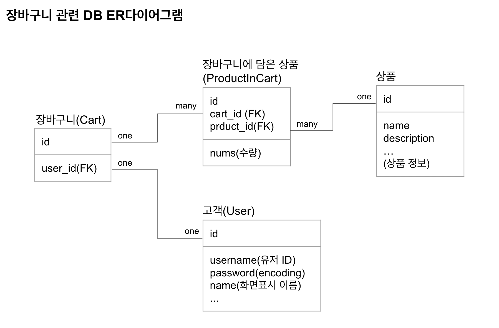

## Clone Coding - 마켓컬리(Backend)

### 개요
#### Frontend github link
- [Clone Coding - 마켓컬리(Frontend)](https://github.com/MyoungSeob/clone_kurly  

#### 함께한 팀원
- Frontend : 이명섭, 정성목
- Backend : 이세정, 손윤환

#### 진행 기간
- 2021.4.2(금) ~ 2021.4.8(목)

#### 사용 언어 및 Tools
- 주요 구현 : Java & Spring 프레임워크(Springboot, SpringSecurity, SpringdataJPA 등)
- API 요청을 통한 크롤링 : Python3 
  - Java를 통한 Jsoup, selenium 등 활용해 보았지만 API 요청을 통한 데이터 수집이 실무를 바라보는데 가장 적합하다고 판단.
- 코드 간소화 : lombok
- JWT 생성/활용 : jjwt
- DB : AWS Amazon RDS 
- RDB 엔진 : MySQL

#### 주요 구현 기능
메인 화면을 통해 상품 페이지에 접근하여 장바구니에 상품들을 담고 확인하는 것을 목표로 프로젝트를 진행함.
1. CORS(Cross-Origin Resource Sharing) 구현
2. 로그인/회원가입 기능 구현(+ JWT 구현을 통한 보안 기능 구현)
   - JWT(Json Web Token) 생성/확인 기능 구현
   - JwtAuthenticationFilter 를 통한 본 기능 실행 전 token 확인 절차 구현
3. 홈 화면 제품 및 광고 카드, 제품 상세 페이지 data 반환 API 구현
   - 마켓컬리 API 요청 후 DB 저장하는 방식을 통한 제품 DB 구축
   - GET 방식 api 요청을 통해 DB 내 product 반환
4. 장바구니 기능 구현
   - 장바구니 및 장바구니에 담긴 상품 관계 설정  
      
   - 클래스 구현 및 CRUD 기능 구현